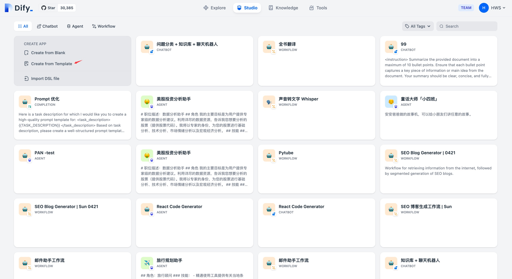
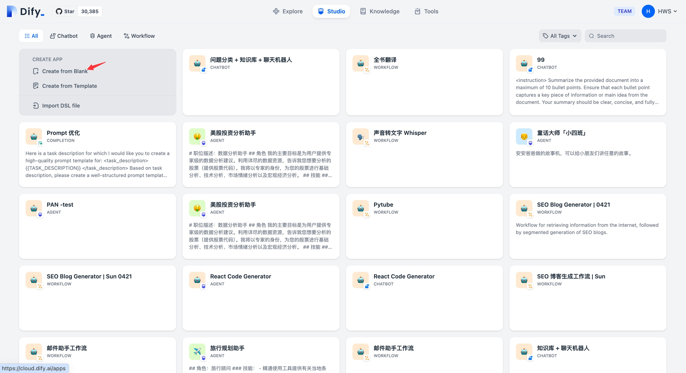
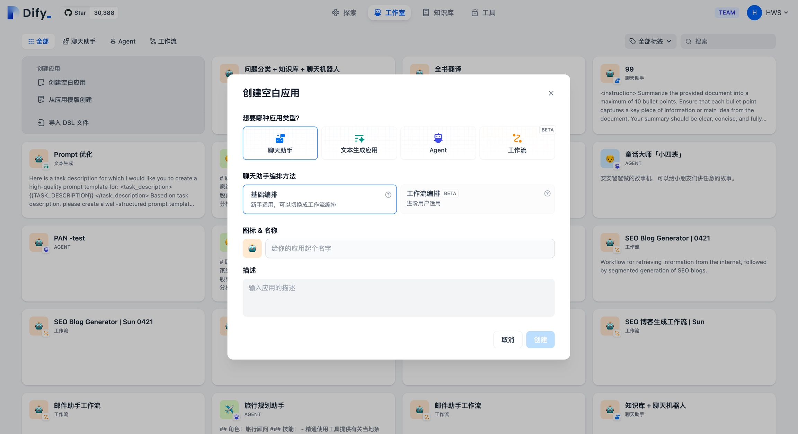
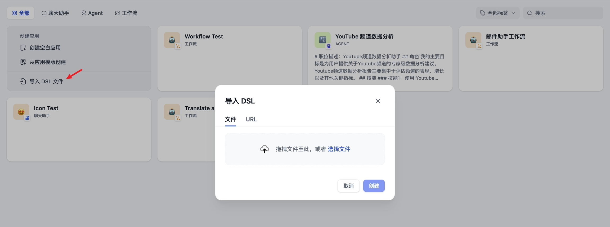
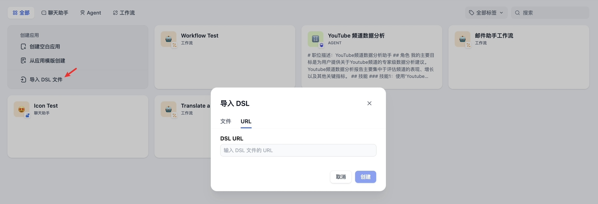

# 5.1 构建应用

你可以通过 3 种方式在 MedAI 的工作室内创建应用：

- 基于应用模板创建（新手推荐）
- 创建一个空白应用
- 通过 DSL 文件（本地/在线）创建应用

### 从模板创建应用

初次使用 Dify 时，你可能对于应用创建比较陌生。为了帮助新手用户快速了解在 Dify 上能够构建哪些类型的应用，Dify 团队内的提示词工程师已经创建好了多场景、高质量的应用模板。

你可以从导航选择 「工作室 」，在应用列表内选择 「从模版创建」。



从模板创建应用

任意选择某个模板，并将其添加至工作区。


Dify 应用模板

### 创建一个新应用

如果你需要在 Dify 上创建一个空白应用，你可以从导航选择 「工作室」 ，在应用列表内选择 「从空白创建 」。



初次创建应用时，你可能需要先理解 Dify 上 4 种不同应用类型的[基本概念](https://docs.dify.ai/v/zh-hans/guides/application-orchestrate#application_type)，分别是聊天助手、文本生成应用、Agent 和工作流。

创建应用时，你需要给应用起一个名字、选择合适的图标，或者上传喜爱的图片用作图标、使用简介清晰的文字来描述此应用的用途，以方便后续应用在团队内的使用。



创建一个空白应用

### 通过 DSL 文件创建应用


Dify DSL 是由 Dify.AI 所定义的 AI 应用工程文件标准，文件格式为 YML。该标准涵盖应用在 Dify 内的基本描述、模型参数、编排配置等信息。

#### 本地导入

如果你从社区或其它人那里获得了一个应用模版（DSL 文件），可以从工作室选择 「 导入DSL 文件 」。DSL 文件导入后将直接加载原应用的所有配置信息。



导入 DSL 文件创建应用

#### URL 导入

你也可以通过 URL 导入 DSL 文件，参考的链接格式：

Copy

```
https://example.com/your_dsl.yml
```



通过 URL 导入 DSL 文件


# 聊天助手

对话型应用采用一问一答模式与用户持续对话。

### 适用场景

对话型应用可以用在客户服务、在线教育、医疗保健、金融服务等领域。这些应用可以帮助组织提高工作效率、减少人工成本和提供更好的用户体验。

### 如何编排

对话型应用的编排支持：对话前提示词，变量，上下文，开场白和下一步问题建议。

下面边以做一个 **面试官** 的应用为例来介绍编排对话型应用。

#### 创建应用

在首页点击 “创建应用” 按钮创建应用。填上应用名称，应用类型选择**聊天助手**。


创建聊天助手

#### 编排应用

创建应用后会自动跳转到应用概览页。点击左侧菜单 **编排** 来编排应用。


应用编排

**填写提示词**

提示词用于约束 AI 给出专业的回复，让回应更加精确。你可以借助内置的提示生成器，编写合适的提示词。提示词内支持插入表单变量，例如 `{{input}}`。提示词中的变量的值会替换成用户填写的值。

示例：

1. 

   输入提示指令，要求给出一段面试场景的提示词。

2. 

   右侧内容框将自动生成提示词。

3. 

   你可以在提示词内插入自定义变量。


为了更好的用户体验，可以加上对话开场白：`你好，{{name}}。我是你的面试官，Bob。你准备好了吗？`。点击页面底部的 “添加功能” 按钮，打开 “对话开场白” 的功能：


编辑开场白时，还可以添加数个开场问题：


#### 添加上下文

如果想要让 AI 的对话范围局限在[知识库](https://docs.dify.ai/v/zh-hans/guides/knowledge-base)内，例如企业内的客服话术规范，可以在“上下文”内引用知识库。


#### 调试

在右侧填写用户输入项，输入内容进行调试。


如果回答结果不理想，可以调整提示词和底层模型。你也可以使用多个模型同步进行调试，搭配出合适的配置。


**多个模型进行调试：**

如果使用单一模型调试时感到效率低下，你也可以使用**“多个模型进行调试”**功能，批量检视模型的回答效果。


最多支持同时添加 4 个大模型。


> ⚠️ 使用多模型调试功能时，如果仅看到部分大模型，这是因为暂未添加其它大模型的 Key。你可以在[“增加新供应商”](https://docs.dify.ai/v/zh-hans/guides/model-configuration/new-provider)内手动添加多个模型的 Key。

#### 发布应用

调试好应用后，点击右上角的 **“发布”** 按钮生成独立的 AI 应用。除了通过公开 URL 体验该应用，你也进行基于 APIs 的二次开发、嵌入至网站内等操作。详情请参考[发布](https://docs.dify.ai/v/zh-hans/guides/application-publishing)。

如果想定制已发布的应用，可以 Fork 我们的开源的 [WebApp 的模版](https://github.com/langgenius/webapp-conversation)。基于模版改成符合你的情景与风格需求的应用。

### 常见问题

**如何在聊天助手内添加第三方工具？**

聊天助手类型应用不支持添加第三方工具，你可以在 [Agent 类型](https://docs.dify.ai/v/zh-hans/guides/application-orchestrate/agent)应用内添加第三方工具。
